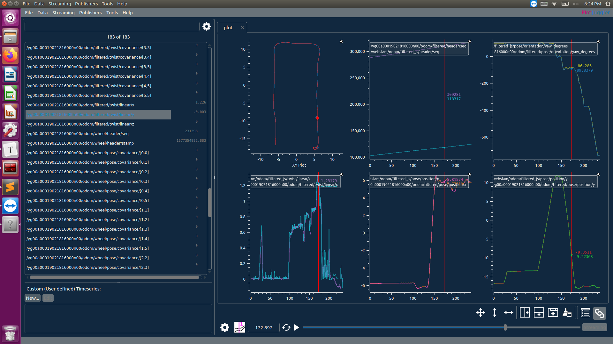

## 20191226_运动规划组SLAM测试报告

| 版本 | 测试人             | 报告整理人 | 日期       |
| ---- | ------------------ | ---------- | ---------- |
| v1.0 | 蒋丹丹,温从标,焦健 | 焦健       | 2019-12-26 |
|      |                    |            |            |
|      |                    |            |            |

## 1. 测试方法

前置条件: web组蒋丹丹与SLAM组温从标的数据输入.

SLAM的IPC提供定位数据/webslam/odom/filtered_js

yg的IPC提供定位数据/yg.../odom/filtered, 两者通过网线相连, 从yg端获得webslam的定位数据.

录制两者的rosbag并进行比较.

1) 两者进行比较.对比路径的准确性, 延迟

2) 把webslam的定位数据直接作为运动规划的输入.进行控制

## 2. 测试结果

1)  把webslam的定位数据直接作为运动规划的输入.进行控制

使用webslam作为定位数据进行控制的时候, 由于数据传输不稳定, 导致yg端报gloca timeout. 从而小车在6.08分之前处于前进, 卡顿+前进的模式中.

2) 两者进行比较.对比路径的准确性, 延迟

之后切换为手动模式, 录制了相关的rosbag进行分析, 分析如下

如图所示, y方向的粗略看到的实时定位,相差20cm以上, 这个是对于控制来说很难接受的, 此时的速度为1.2m/s.粗略看了一下定位误差大部分保持在10cm以上.

## 3.建议

1) 继续提升实时性

2) 在接收端做一次后处理.

## 4. 附录

rosbag(两次定位数据)